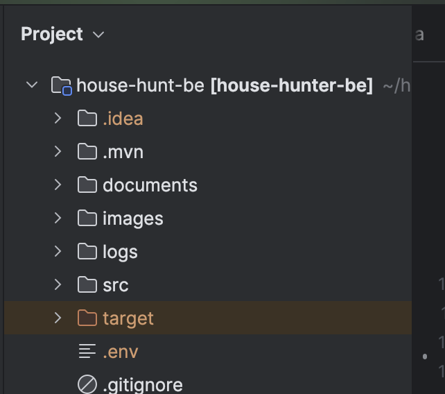

# House Hunter Backend

This is the backend service for the House Hunter application, a user verified real estate marketplace. It's a Spring
Boot application that uses PostgreSQL and Redis as its
database.

## Prerequisites

Before you begin, ensure you have met the following requirements:

- You have installed of Java 17, Maven, Docker.

Running the Project

- Clone the repository to your local machine.

- Switch to the project directory.

 ```
cd house-hunt-be
 ```

- Open the project in IntelliJ IDEA.
- Copy the .env file given you by email and paste it in the root directory of the project, this file includes the secret
  for sign the JWT Token.
  

- To run the project, you can use Docker Compose. Go to the directory of the project and run the following command:

```
docker-compose up --build
```

- This will start the application and the PostgreSQL & Redis database. The application will be available
  at http://localhost:8080.

- To initialize the database with some data such as USER ROLES and other necessary info, you can use the following sql
  file to fill up the database.

```
  src/main/resources/db/scripts/data.sql
```

- Run the following command to execute the sql file from the root directory of the project.

```
 docker exec -i db psql -U postgres -d house_hunter < src/main/resources/db/scripts/data.sql  
```

This will fill up the database with the necessary data.
Now you can access the application at http://localhost:3000/house-hunt-fe#/
Default users for login on the frontend are:

- ADMIN:

```
{
"email": "admin@admin.com",
"password": "Heybitch12345./+"
}
```

- TENANT:

```
{
"email": "tenant@tenant.com",
"password": "Heybitch12345./+"
}
```

- LANDLORD:

```
{
"email": "landlord@landlord.com",
"password": "Heybitch12345./+"
}
```

- For testing purposes, you can register either TENANT or LANDLORD from frontend.
- Do not forget to put an email that you have access to, as you will need to verify your email to login.
- For swagger documentation:

```
http://localhost:8080/swagger-ui/index.html
```
